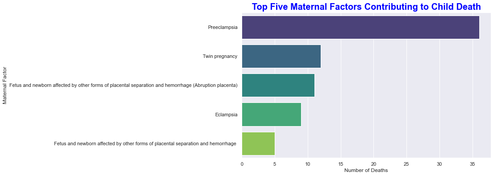

# Data Analytics, Modeling and Evaluation 
## Dataset
>This data set includes information about champs data

## Preprocessing and EDA
In this section various activities are perforemd such as cleaning, transforming, and prepare data for analysis while gaining insights into its structure, relationships, and patterns through visualizations and statistical summaries.

### Dataset 
>The dataset contains 444 records and 4 columns 
> Data cleansing 
> 

## Descriptive Analysis

*****Insight from the above | underlying cause*****
- the above descriptive summary and the bar graph shows clear and precise information. accordingly here is few summary given below to make it simplify.
> - `Intrauterine hypoxia`, is the most and far highest underlying cause for infant death and it covers 33% of the total deaths.
> - `Birth asphyxia` is the second most underlying cause the for the infant death and it covers 7% of the total deaths.
> - 6% of the infant death is `Undetermined` their underlying cuses which is ranked thirdly accordingto the given dataset.
> - Next, `Severe acute malnutrition` is the cause for the infant death which is 5%. 
- In summary considering the magnitude and proportion of the underlying cause, there should be a special attention to reduce the infant death caused by `Intrauterine hypoxia`.

*****Insight from the above | Case Type*****
- The above descriptive summary and the pie chart shows clear and precise information about the case type in relation to infant death . Accordingly, here is few summary given below to make it ease.
> - `Stillbirth`, is the first most highest case type in infant death and it accounts 53% of the total deaths cases.
> - `Death in the first 24 hours` is the second most case type in the infant death and it accounts 15% of the total deaths cases.
> - `Early Neonate (1 to 6 days)` accounts 11% in the infant death which is ranked thirdly accordingto the given dataset.
> - Next, `Child (12 months to less than 60 months)` accounts 9% in the infant death. 
- In summary considering the magnitude and proportion of the case type in relation to infant death, it requiers a specila research and study to mitigate the problem behind the case type `Stillbirth`.

## Feature Engineering 

Here are the most important feature in the model in deacreasing order
- Random Forest
    >  - Maternal Factor_Undetermined 
    >  - Maternal Factor_Preeclampsia
    >  - Maternal Factor_Fetus and newborn affecte

## Model Evaluation 
 *** N-fold cross validation ***
 > - Logistic Regression: 0.6575
 > - Support Vector Machine: 0.6575
 > - AdaBoost: 0.6575 
 > - Random Forest: 0.6575 
 > - Gradient Boosting: 0.6575
 > - XGBoost: 0.6644 ± 0.0098
 - The Best Model is identified as XGBoost

 *** Using Accuracy score metrics ***
 > - Logistic Regression Test Accuracy: 0.8095
 > - Support Vector Machine Test Accuracy: 0.8095
 > - AdaBoost Test Accuracy: 0.7778
 > - Random Forest Test Accuracy: 0.8095
 > - Gradient Boosting Test Accuracy: 0.8095
 > - XGBoost Test Accuracy: 0.8095
 > - Ensemble Model Test Accuracy: 0.8095
- Most of the perform the same 

*** AUC and ROC Curved ***

## Visualization

